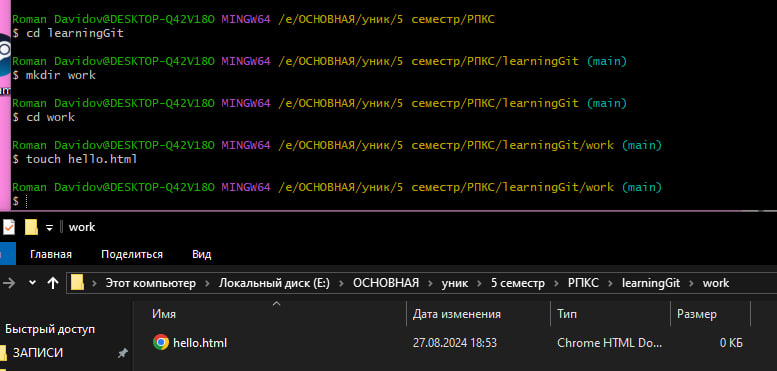
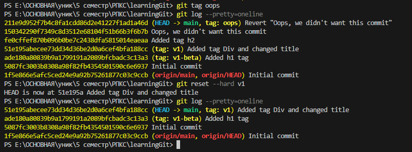
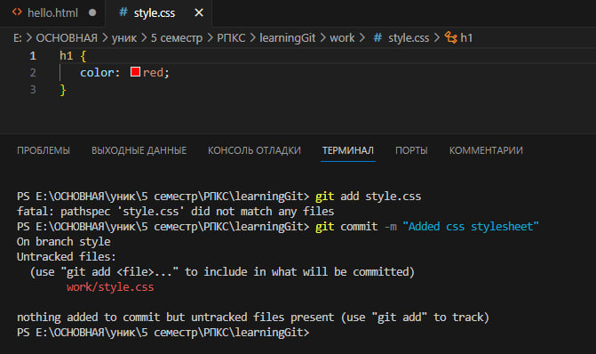
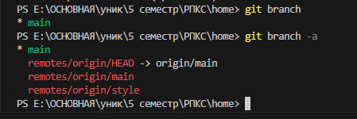

<p align="center">
  
</p>
Створюємо репозиторій на GitHub.    <br> <br>

<p align="center">
  
</p>
Підключаємось до репозиторію.     <br> <br>

<p align="center">
  
</p>
Переходимо в необхідну папку і робимо клон репозиторію.     <br> <br>

<p align="center">
  
</p>
По потрібному шляху видно, що проект був клонований у потрібне місце.  <br> <br>

<p align="center">
  
</p>
Переходимо в директорію клона і там створюємо папку Work. Потім входимо в неї і створюємо файл hello.html.  <br> <br>

<p align="center">
  
</p>
Виходимо назад у папку і створюємо коміт для файлу Work/hello.html. <br> <br>

<p align="center">
  
</p>
Перевіряємо статус гіта (в якій гілці ми знаходимося). Через те, що я трохи змінив підхід і створив репозиторій заздалегідь, у ньому є один коміт. <br> <br>

<p align="center">
  
</p>
Додали нові зміни і бачимо, що файл тепер модифікований і статус змінено. <br> <br>

<p align="center">
  
</p>
Команда `git commit` (ввімкнувся редактор коду для опису комміту). <br> <br>

<p align="center">
  
</p>
Команда `git commit` (виконная та успішний статус). <br> <br>

<p align="center">
  
</p> Зроблено дві зміни: перше - додано тег ```<div>``` для ```<h1>```, друге - змінено `title` документа з `document` на `Hello document!` <br> <br>

<p align="center">
  
</p> Після додавання деяких змін (тега `h2`), видно, що файл був змінений, але не закомічений. <br> <br>

<p align="center">
  
</p> З допомогою команди `git add .` можна одразу перевірити всі файли проєкту і додати їх до коміту. Після перевірки статусу видно, що зміни у файлі були прийняті. <br> <br>

<p align="center">
  
</p> За допомогою команди `git log` можна отримати всю історію проєкту. <br> <br>

<p align="center">
  
</p> Або, якщо в одній строчці, то командою `git log --pretty=oneline`. <br> <br>

<p align="center">
  
</p> Також інші варіанти перегляду історії. <br> <br>

<p align="center">
  
</p> Перемкнувся на перший коміт і видно, що було у файлі з самого початку. <br> <br>

<p align="center">
  
</p> Перемикаємося на основну гілку і бачимо, що тут зберігається вже справжній документ. <br> <br>

<p align="center">
  
</p> Створюємо тег версії. <br> <br>

<p align="center">
  
</p> Створюємо тег для попередньої версії. <br> <br>

<p align="center">
  
</p> Тепер перший коміт має тег `v1-beta`. <br> <br>

<p align="center">
  
</p> Перемикаємося по тегам. <br> <br>

<p align="center">
  
</p> Переглядаємо список усіх тегів. <br> <br>

<p align="center">
  
</p> Тут можна побачити в основній гілці всі логи і їхні теги. <br> <br>

<p align="center">
  
</p> Створення непотрібного коментаря і перевірка статусу репозиторія. <br> <br>

<p align="center">
  
</p> Перемикаємося на версію файлу в репозиторії. <br> <br>

<p align="center">
  
</p> Бачимо, що у файлі більше немає того коментаря, який був створений раніше. Непроіндексовані зміни були видалені. <br> <br>

<p align="center">
  
</p> Тепер скасовуємо проіндексацію змін. Створюємо коментар, зберігаємо файл і робимо індексацію перед комітом. <br> <br>

<p align="center">
  
</p> Прибираємо проіндексацію. <br> <br>

<p align="center">
  
</p> Після перемикання на версію коміту коментар був видалений з файлу. <br> <br>
<p align="center">
  
</p> Тепер спробуємо видалити коміт. Для цього створимо тестовий варіант з коментарем і зробимо коміт з назвою "Oops, we didn't want this commit". <br> <br>

<p align="center">
  
</p> Для скасування коміту використовуємо команду `git revert HEAD` і переходимо в редактор. Тут залишаємо все як є. <br> <br>

<p align="center">
  
</p> Переглядаємо логи і бачимо, що тут є скасований коміт (перший). Але в цьому випадку коміт все ще видно в логах, і це може бути "недобре". <br> <br>

<p align="center">
  
</p> На цьому скріншоті встановлюється тег для останнього коміту, а після цього з використанням команди `git reset --hard v1` ми видаляємо всі коміти до коміту з тегом `v1`. Таке може бути небажаним, оскільки в цьому випадку також було видалено коміт з створенням `h2`. Потрібно бути обережним при його використанні. <br> <br>

<p align="center">
  
</p> Видаляємо тег `oops` командою `git tag -d oops`. `-d` означає delete. <br> <br>

<p align="center">
  
</p> Внесення змін у коміти. Спочатку створимо коміт з частиною коду з Вікіпедії. <br> <br>

<p align="center">
  
</p> Трохи змінюємо і тепер за допомогою команди `git commit --amend -m <опис>` перезаписуємо останній коміт. У логах видно, що старий коміт замінився новим. <br> <br>

<p align="center">
  
</p> Створюємо нову гілку і автоматично перемикаємося на неї. <br> <br>

<p align="center">
  
</p> Додаємо файл стилів `style.css`. <br> <br>

<p align="center">
  
</p> Додаємо у гілку також і змінений HTML файл, створюючи новий коміт. <br> <br>

<p align="center">
  
</p> Тепер вивчаємо перемикання гілок. <br> <br>

<p align="center">
  
</p> Після перемикання на основну гілку за допомогою команди `git switch main` файл автоматично прибрав зміни з `hello.html` (зникла строка з підключенням файлу CSS). Тією ж командою можна перемикатися між гілками. <br> <br>

<p align="center">
  
</p> За допомогою команди `git show <tag>` можна переглянути зміни у файлі, які були внесені. <br> <br>

<p align="center">
  
</p> Після перейменування git вважає, що файл був видалений і створено новий. <br> <br>

<p align="center">
  
</p> Для виправлення ситуації необхідно проіндексувати його. <br> <br>

<p align="center">
  
</p> Для того щоб перейменувати або перенести файл безпечно, необхідно використовувати команду разом з git. Тоді вона гарантовано буде записана в git як переміщення. <br> <br>

<p align="center">
  
</p> Після цього, щоб переглянути логи переміщення і зміни назв файлів, необхідно вказати додатковий атрибут `--follow` у команді `git log --follow <шлях>`. <br> <br>

<p align="center">
  
</p> Перегляд логів усіх гілок здійснюється за допомогою опцій --all, яка надає результат усіх гілок, та --graph, що додає дерево комітів для зручності читання. <br> <br>

<p align="center">
  
</p> Для того щоб зробити злиття двох гілок використовується команда `git merge <назва гілки>`. Необхідною умовою є знаходження на тій гілці, яку потрібно злити з іншою гілкою. У цьому випадку гілка `style` зливається з гілкою `main`. <br> <br>

<p align="center">
  
</p> На цьому скріншоті відбувається перехід до основної гілки і зміна файлу `hello.html` конфліктуючими даними (зміна назви документа, видалення рядків). Після цього переглядаємо логи гілок і бачимо, що деякі гілки переплітаються і конфліктують одна з одною. <br> <br>
<p align="center">
  
</p> Після переходу на гілку Style і спроби злиття отримуємо помилку. Це нормально, бо git не зміг автоматично вирішити конфлікти і просить нашого ручного втручання. <br> <br>

<p align="center">
  
</p> Після відкриття файлу видно місця конфліктів. Останній тег <div> з втраченим (зміненим текстом) автоматично зміг побудуватися, але з рештою змін git не впорався. <br> <br>

<p align="center">
  
</p> Перед тим як виправляти конфлікти - скасовуємо злиття. <br> <br>

<p align="center">
  
</p> Після чого вирішуємо всі конфлікти. <br> <br>

<p align="center">
  
</p> І робимо коміт. Тепер конфліктів бути не повинно. <br> <br>

<p align="center">
  
</p> Для перевірки різниці між злиттям (`merge`) і перебазуванням (`rebase`) необхідно повернутися до моменту злиття в гілці `style`. <br> <br>

<p align="center">
  
</p> Пов'язано з минулим скрином <br> <br>

<p align="center">
  
</p> При спробі перебазувати (`rebase`) гілку конфлікти нікуди не зникли, але тепер конфлікти не в файлі `hello.html`, а в файлі `index.html`. Це сталося тому, що `rebase` знаходився в процесі зміни `style` поверх гілки `main`. <br> <br>

<p align="center">
  
</p> Після вирішення конфліктів і повторної індексації всі проблеми були вирішені, все добре перебазувалося, і тепер гілка комітів стала більш правильною і лінійною. <br> <br>

<p align="center">
  
</p> Здійснюємо злиття з основною гілкою `main` за допомогою `merge`. <br> <br>

<p align="center">
  
</p> Тепер створимо клон репозиторія в кореневій папці за допомогою команди `git clone <назва репозиторія> <назва папки для клону репозиторія>`. <br> <br>

<p align="center">
  
</p> Команда `git remote` показує ім'я за замовчуванням віддаленого репозиторія. Ім'я `origin` застосовується як ім'я первинного централізованого репозиторія. <br> <br>

<p align="center">
  
</p> В клону репозиторія можна також дізнатися про поточні гілки та отримати список віддалених гілок. <br> <br>

<p align="center">
  
</p> Змінюємо файл `README.md` в основному репозиторії і додаємо коміт. <br> <br>

<p align="center">
  
</p> У другому репозиторії (клоні) підтягуючи зміни у файлі `README.md`. <br> <br>

<p align="center">
  
</p> Скриншот для показу того, що файл був змінений. <br> <br>

<p align="center">
  
</p> За допомогою команди `git merge origin/main` виконуємо злиття підтягнутих змін в локальну гілку. Використовуючи команду `git pull`, яка швидко зливає зміни з віддаленої гілки в поточну за один виклик замість двох (1. `git fetch` 2. `git merge origin/main`). <br> <br>

<p align="center">
  
</p> Додаємо гілку, яка буде відстежувати віддалену гілку, за допомогою команди `git branch --track style origin/style`. Переглядаємо всі гілки командою `git branch -a`. <br> <br>

<p align="center">
  
</p> Для створення чистого репозиторія використовуємо команду `git clone --bare work work.git`. <br> <br>

<p align="center">
  
</p> Для того щоб додати чистий репозиторій як віддалений репозиторій до оригіналу, необхідно використовувати всередині основного репозиторія команду `git remote add shared ../work.git`. <br> <br>

<p align="center">
  
</p> Після внесення змін у файл `README.md` і створення коміту, відправляємо зміни в загальний репозиторій, створений на попередньому кроці. <br> <br>

<p align="center">
  
</p> За допомогою наступних команд підтягнемо в репозиторій `home` зміни, що були відправлені в загальний репозиторій: <br> 
<code>git fetch shared</code> <br>
<code>git merge shared/main</code> <br> <br>

<p align="center">
  
</p> Щоб розмістити Git-репозиторій на GitHub, можна використовувати команду <code>git daemon --verbose --export-all --base-path=.</code> і посилання на папку з репозиторіями. Після цього перейти в іншому терміналі і виконати команди в тій же папці: <br> 
<code>git clone git://localhost/work.git network_work</code> <br> 
<code>cd network_work</code> <br>
<code>ls</code> <br>
Можна буде побачити копію проєкту.

